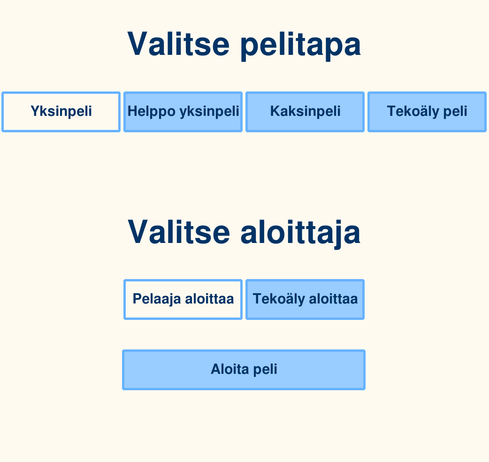
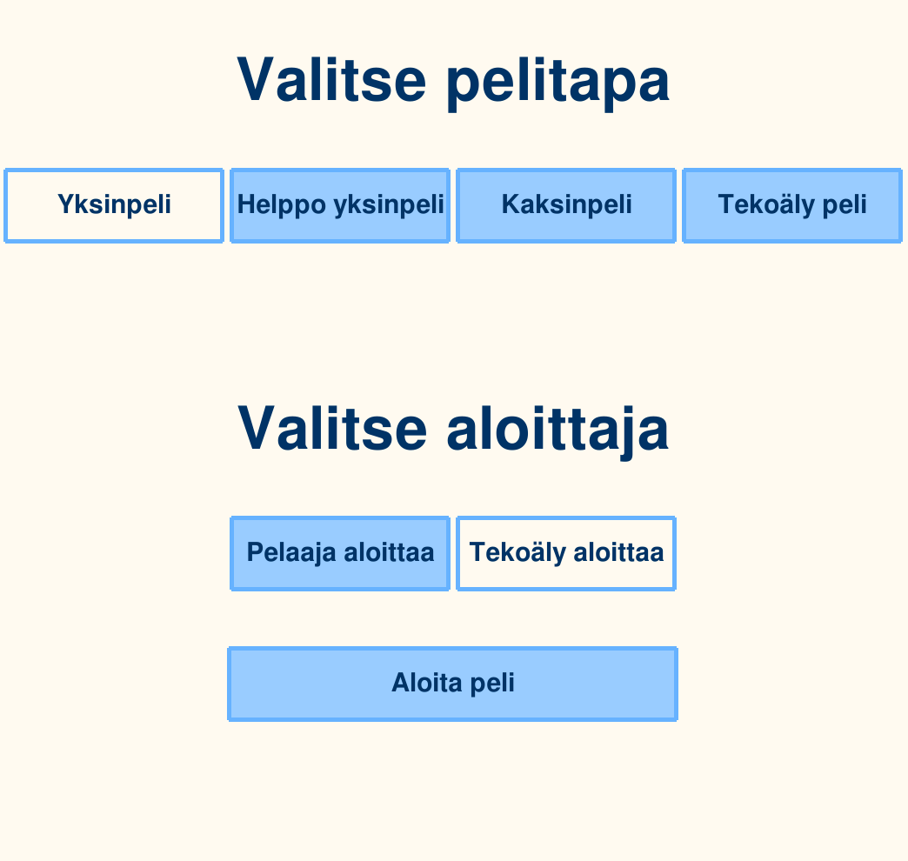
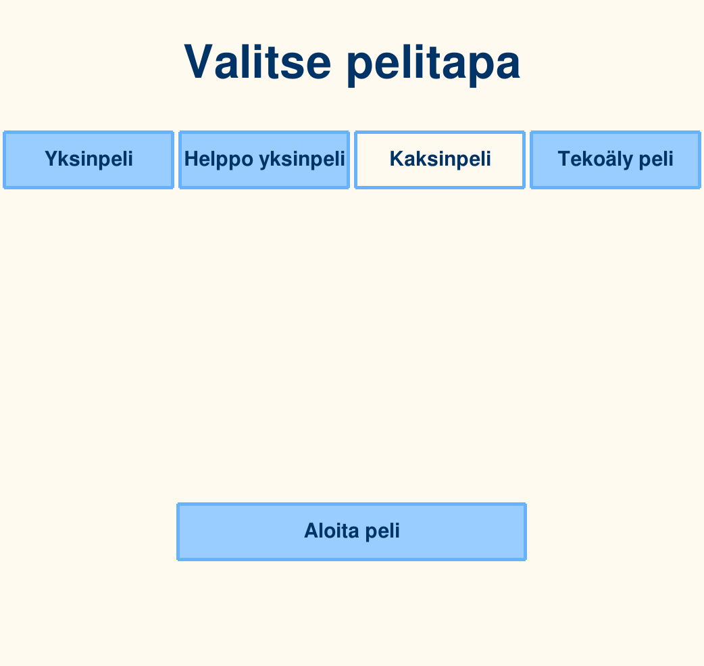

# Neljänsuoran käyttöohjeet

## Tarvittavat komennot:
lataa ohjelma itsellesi komennolla " git clone "työn linkki" "
siirry työn kansioon
lataa poetry komentorivillä komenolla poetry install

voit aloittaa pelin komennolla "python3 src/indeksi.py", kun olet kansiossa

## Ohjeet pelaamiseen

Kun olet käynnistänyt pelin aukeaa aloitusruutu alla olevalla tavalla

Voit vaihtaa pelimuotoa tai aloittajaa

Jos valitset kaksinpelin tai tekoaly pelin, aloittajaa ei valita ja niiden valikko häviää

