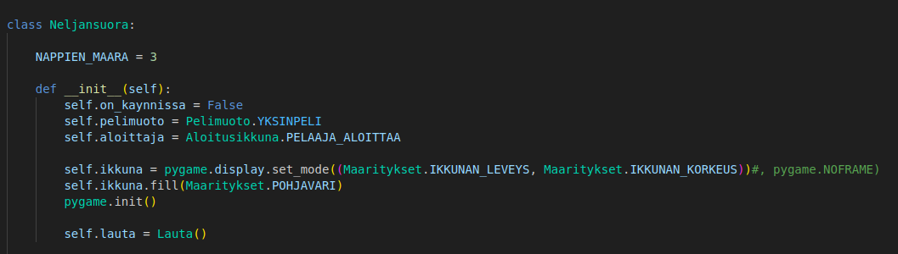
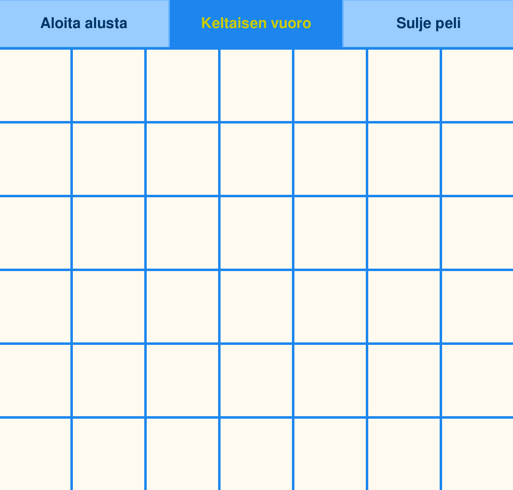
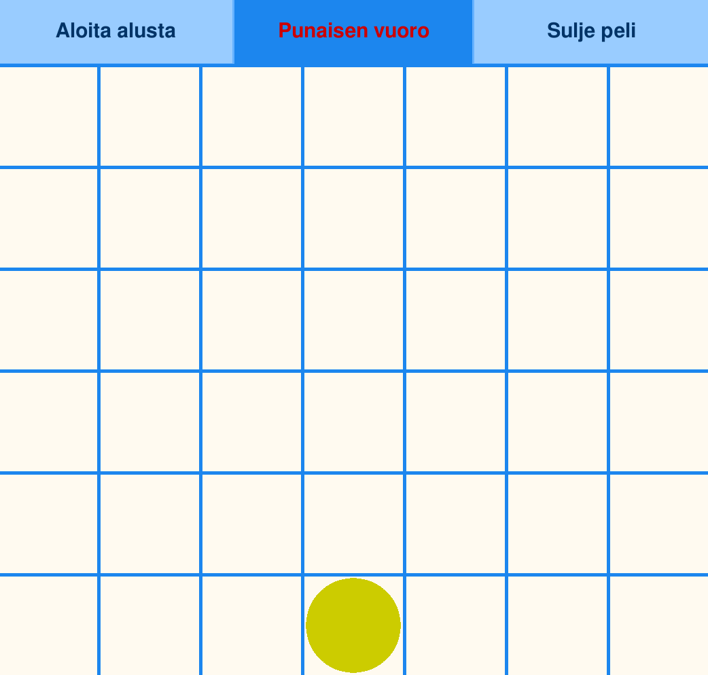
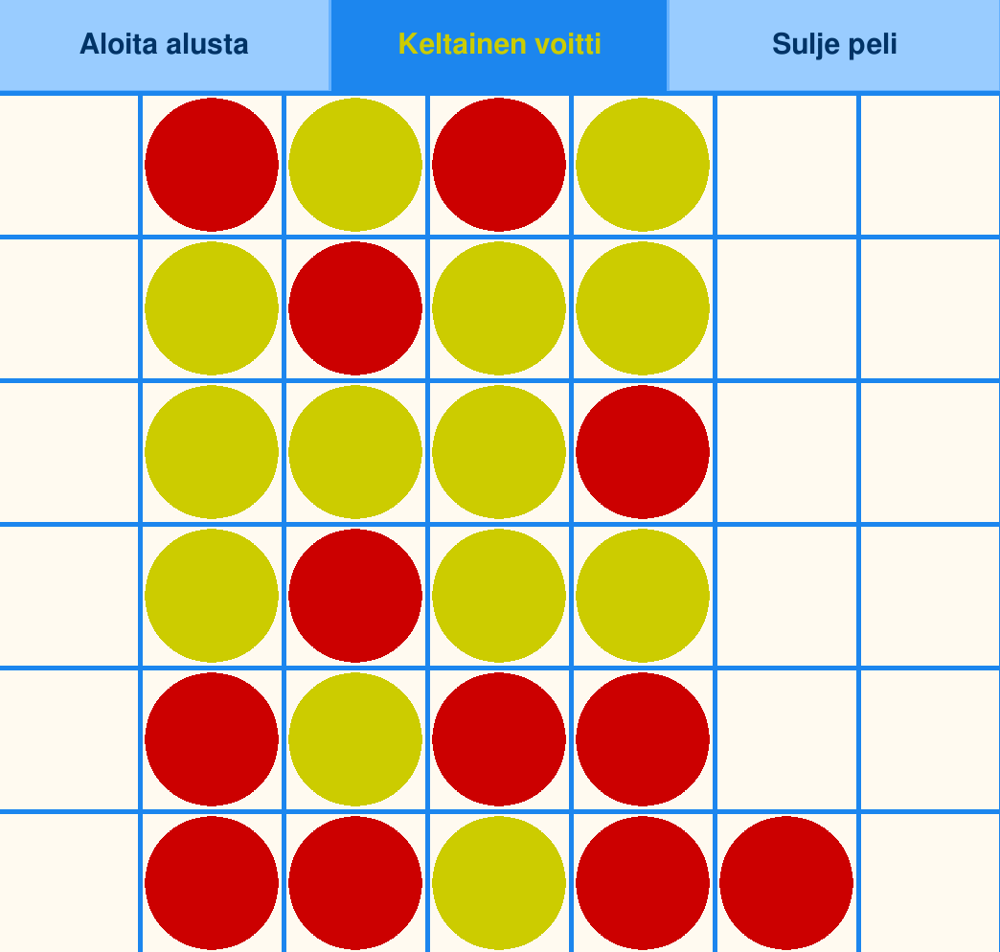
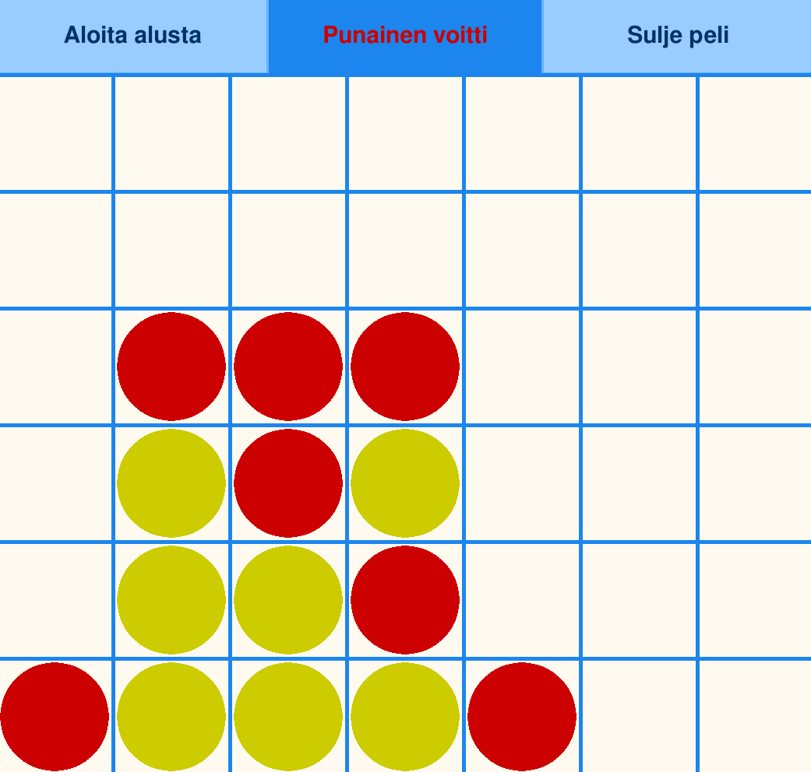
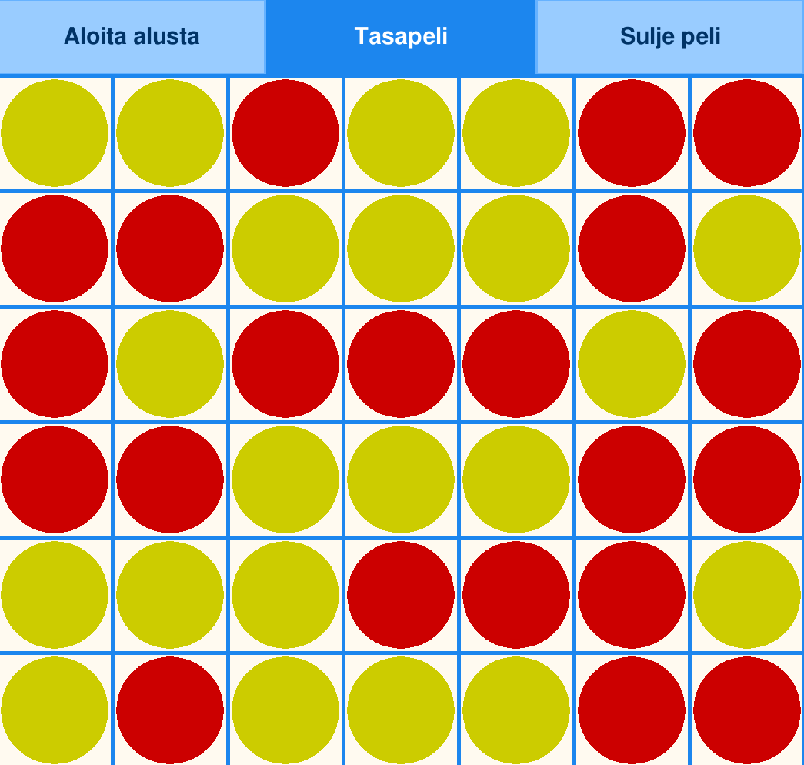

# Neljänsuoran käyttöohjeet

## Tarvittavat komennot:
1. Lataa ohjelma itsellesi komennolla " git clone "työn linkki" "

2. Siirry ohjelman kansioon komennolla "cd Tiha"

3. Lataa poetry komentorivillä komenolla poetry install

4. Voit aloittaa pelin komennolla "python3 src/indeksi.py", kun olet kansiossa

## Muutama asia, jotka auttavat testaamisessa

1. Ikkunan kokoa voi tarvittaessa vaihtaa, vaihtamalla mmaritys.py Maaritys luokan RUUDUN_KOKO luokkamuuttujaa. Kaikki muu on tehty tämän ympärille.

2. Jos haluat laittaa peliin kehyksen eli englanniksi 'Frame' (en ole varma käännöksestä), niin tämä onnistuu alla kuvatulla tavalla kommentoimalla 'pygame.NOFRAME' pois koodista.

## Ohjeet pelaamiseen

Kun olet käynnistänyt pelin aukeaa aloitusruutu alla olevalla tavalla

Voit vaihtaa pelimuotoa tai aloittajaa

Jos valitset kaksinpelin tai tekoaly pelin, aloittajaa ei valita ja niiden valikko häviää

Kun aloitat pelin. Pelilauta tulee näkyville. Pelilaudalla on aluksi ruudukko, jossa on nappi pelin uudelleen aloittamiselle ja sulkemiselle. Myös kumman pelaajan vuoro on, näkyy ylhäällä keskellä.

Kun pelin aloittaja on asettanut keltaisen pelimerkin, pelivuoro siirtyy punaiselle

Jos keltainen voittaa. Peliruudun yläpuolelle tulee teksti voittajasta

Myös punaiselle tapahtuu sama

Jos tulee tasapeli eli lauta tulee täyteen, samaan kohtaan tulee tasapeli teksti

Jos painat aloita alusta, missä tahansa kohtaa pelin aikana, kun on pelaajan vuoro niin peli alkaa alusta ja palataan aloitusikkunaan

