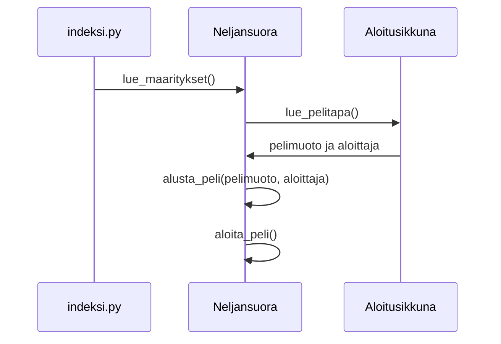
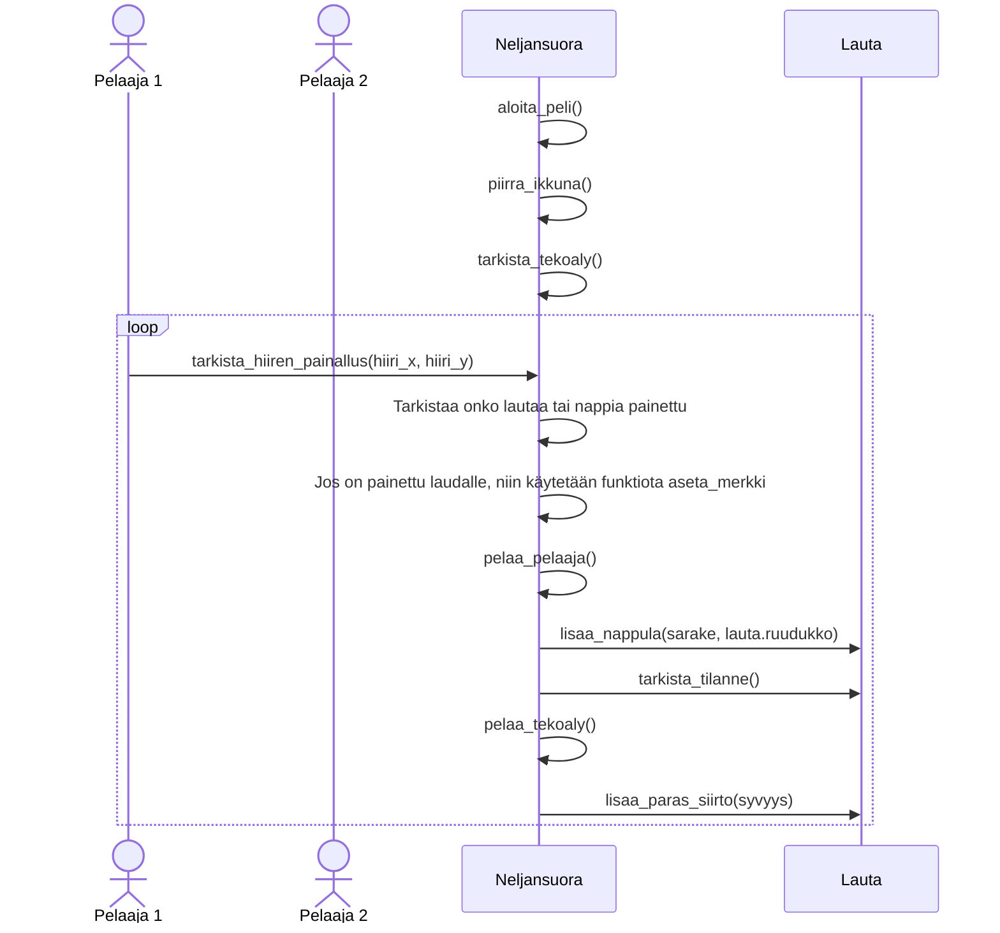
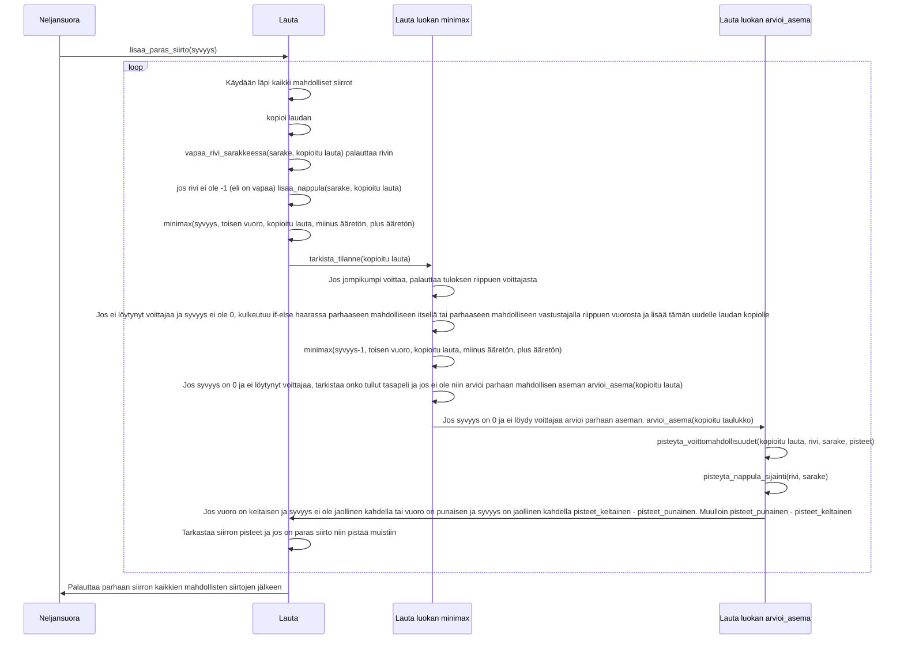

# Toteutusdokumentti

## Käyttöliittymä

Sovelluksen käyttöliittymä on jaettu kahteen eri pääluokkaan. Aloitusikkunnaan joka löytyy samasta
tiedostosta kuin Maarittely luokka eli maarittely.py ja Neljansuora luokkaan, joka löytyy tiedostosta
neljansuora.py

- Pelin aloitusruutu (Aloitusikkuna)
- Neljänsuora peli (Neljansuora)

Peli alkaa kutsumalla Neljansuora luokan lue_maaritykset funktiota. Funktio avaa aloitusikkunan
Aloitusikkuna luokan avustuksella, jossa pelaaja voi valita pelimuodon, sekä kumpi pelaaja aloittaa
riippuen valitusta pelimuodosta. Peli alkaa painamalla aloita peli nappulaa ja alustetaan peli
annetujen arvojen mukaan. Pelissä pelaaja voi omalla vuorollaan, joko pelata nappulan tai painaa
ylhäällä olevista 'aloita alusta' tai 'sulje' nappuloista. Jos painetaan etukäteen, niin pelaajan siirto
tai nappulan painallus tehdään heti tekoälyn lopetettua vuoronsa. 'Aloita alusta' nappi alustaa pelin
ja avaa aloitusikkunan uudelleen. 'Sulje' nappi sulkee ohjelman.

## Diagrammi pelin alustamisesta ja aloittamisesta

Peli aloitetaan indeksi.py tiedostosta ja käynnistetään funktiolla lue_maaritykset().
Aloitusikkuna luodaan Aloitusikkuna luokan funktiota käyttäen lue_pelitapa(). Tämä luo aloitusikkunan, jossa käyttäjä voi valita pelimuodon sekä aloittajan, pelimuodosta riippuen ja palauttaa nämä. Neljansuora luokassa alustetaan peli uudestaan käyttäen kyseistä pelimuotoa ja mahdollista aloittajaa. Tämän jälkeen aloitetaan peli käyttäen funktiota aloita_peli().

## Diagrammi pelin kulusta, kun on yksinpeli ja pelaajan aloitus

Peli alkaa, kun pelaaja on painanut aloitusikkunasta nappia, 'Aloita peli'.
Aluksi piirretään pelilauta, jonka jälkeen tarkastetaan onko aloittajana tekoäly tai onko pelimuotona demo. Tässä tapuksessa ei ole ja heti painalluksesta tarkastetaan mihin kohtaan pelilautaa on painettu funktiota tarkista_hiiren_painallus käyttäen. Jos pelilautaa on painettu, niin pelaa pelaajan vuoron, jos siirto on mahdollinen. Tämän jälkeen tarkistaa heti tilanteen ja jos ei ole löytynyt voittajaa, niin alkaa pelaamaan tekoälyn siirtoa käyttämällä funktiota lisaa_paras_siirto. Tämä jatkuu kunnes jompikumpi voittaa tai tulee tasapeli.

## Diagrammi funktiosta lisaa_paras_siirto ja minimaxista sekä tämän heuristiikasta

