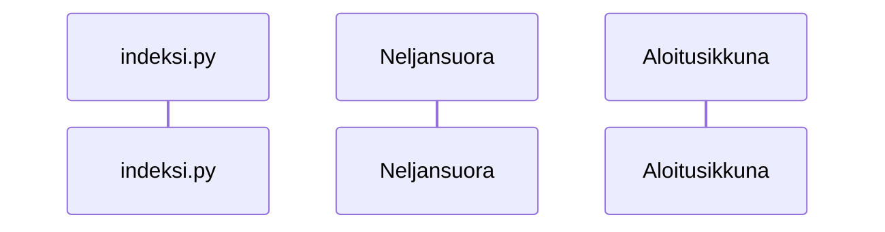

# Toteutusdokumentti

## Käyttöliittymä

Sovelluksen käyttöliittymä oon jaettu kahteen eri luokkaan. Aloitusikkunnaan joka löytyy samasta
tiedostosta kuin Maarittely luokka eli maarittely.py ja Neljansuora luokkaan, joka löytyy tiedostosta
neljansuora.py

- Pelin aloitusruutu (Aloitusikkuna)
- Neljänsuora peli (Neljansuora)

Peli alkaa kutsumalla Neljansuora luokan lue_maaritykset funktiota. Funktio avaa aloitusikkunan
Aloitusikkuna luokan avustuksella, jossa pelaaja voi valita pelimuodon, sekä kumpi pelaaja aloittaa
riippuen valitusta pelimuodosta. Peli alkaa painamalla aloita peli nappulaa ja alustetaan peli
annetujen arvojen mukaan. Pelissä pelaaja voi omalla vuorollaan, joko pelata nappulan tai painaa
ylhäällä olevista 'aloita alusta' tai 'sulje' nappuloista. Jos painetaan etukäteen, niin pelaajan siirto
tai nappulan painallus tehdään heti tekoälyn lopetettua vuoronsa. 'Aloita alusta' nappi alustaa pelin
ja avaa aloitusikkunan uudelleen. 'Sulje' nappi sulkee ohjelman.

