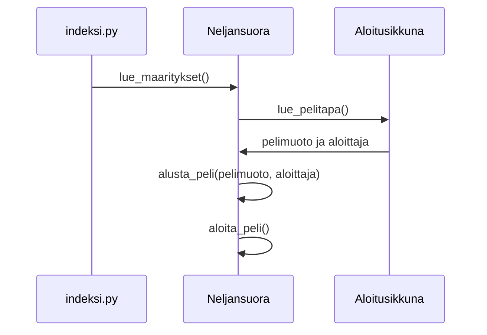
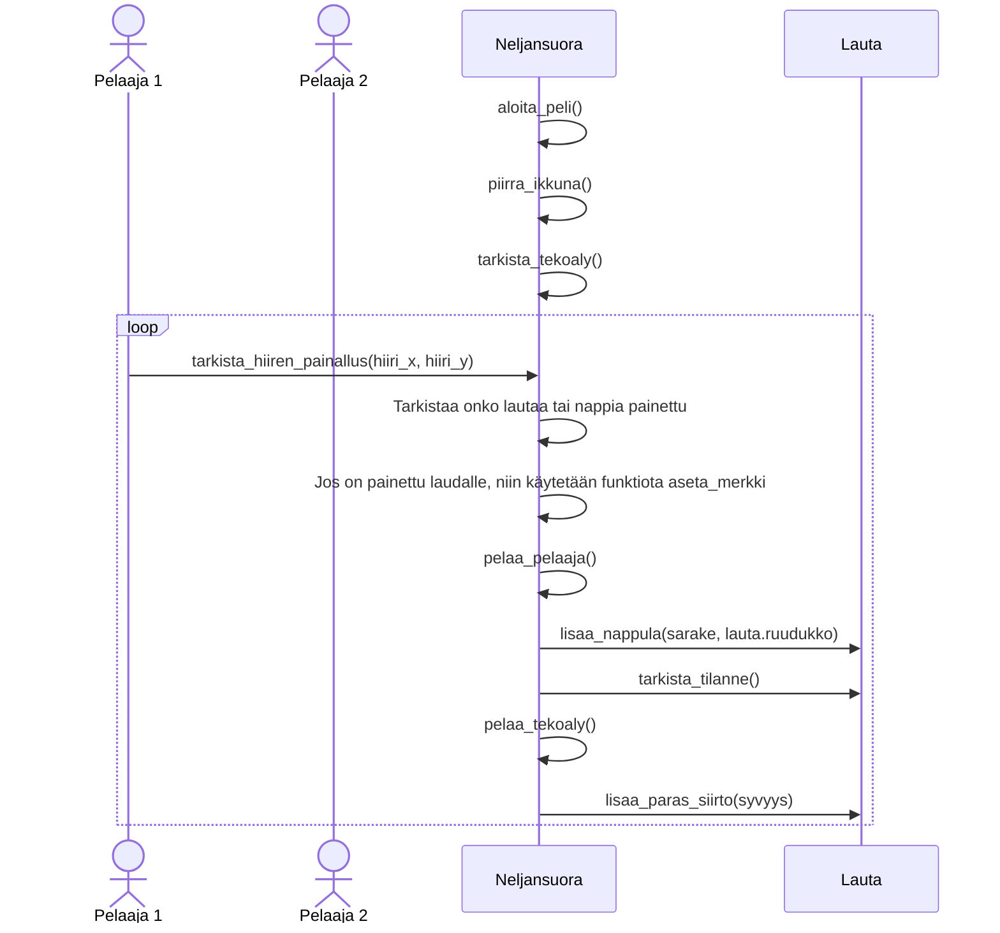
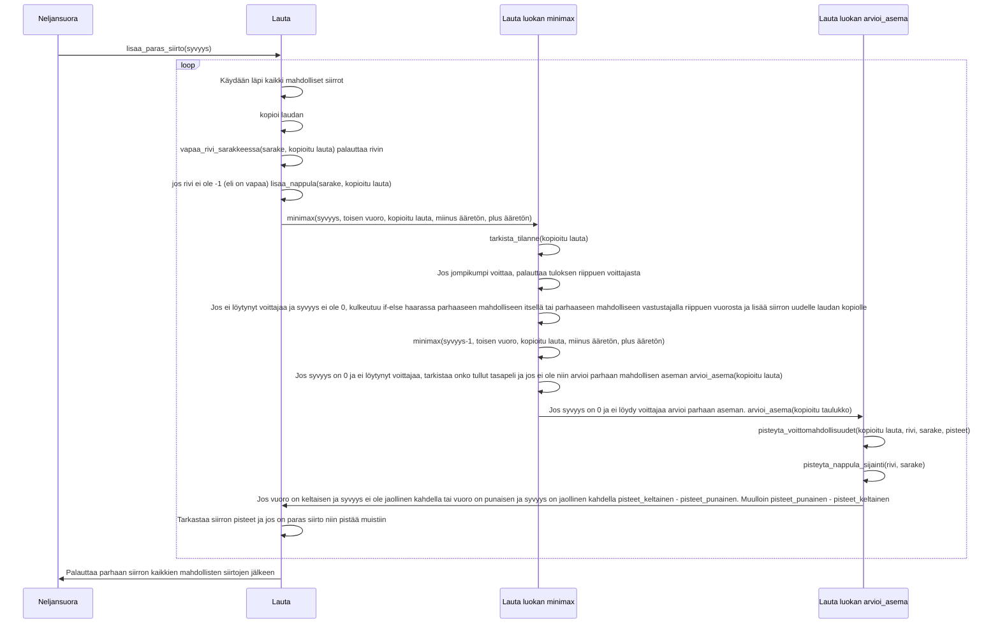

# Toteutusdokumentti

## Käyttöliittymä

Sovelluksen käyttöliittymä on jaettu kahteen eri pääluokkaan. Aloitusikkunnaan joka löytyy samasta
tiedostosta kuin Maarittely luokka eli maarittely.py ja Neljansuora luokkaan, joka löytyy tiedostosta
neljansuora.py

- Pelin aloitusruutu (Aloitusikkuna)
- Neljänsuora peli (Neljansuora)

Peli alkaa kutsumalla Neljansuora luokan lue_maaritykset funktiota. Funktio avaa aloitusikkunan
Aloitusikkuna luokan avustuksella, jossa pelaaja voi valita pelimuodon, sekä kumpi pelaaja aloittaa
riippuen valitusta pelimuodosta. Peli alkaa painamalla aloita peli nappulaa ja alustetaan peli
annetujen arvojen mukaan. Pelissä pelaaja voi omalla vuorollaan, joko pelata nappulan tai painaa
ylhäällä olevista 'aloita alusta' tai 'sulje' nappuloista. Jos painetaan etukäteen, niin pelaajan siirto
tai nappulan painallus tehdään heti tekoälyn lopetettua vuoronsa. 'Aloita alusta' nappi alustaa pelin
ja avaa aloitusikkunan uudelleen. 'Sulje' nappi sulkee ohjelman.

## Diagrammi pelin alustamisesta ja aloittamisesta

Peli aloitetaan indeksi.py tiedostosta ja käynnistetään funktiolla lue_maaritykset().
Aloitusikkuna luodaan Aloitusikkuna luokan funktiota käyttäen lue_pelitapa(). Tämä luo aloitusikkunan, jossa käyttäjä voi valita pelimuodon sekä aloittajan, pelimuodosta riippuen ja palauttaa nämä. Neljansuora luokassa alustetaan peli uudestaan käyttäen kyseistä pelimuotoa ja mahdollista aloittajaa. Tämän jälkeen aloitetaan peli käyttäen funktiota aloita_peli().

## Diagrammi pelin kulusta, kun on yksinpeli ja pelaajan aloitus

Peli alkaa, kun pelaaja on painanut aloitusikkunasta nappia, 'Aloita peli'.
Aluksi piirretään pelilauta, jonka jälkeen tarkastetaan onko aloittajana tekoäly tai onko pelimuotona demo. Tässä tapuksessa ei ole ja heti painalluksesta tarkastetaan mihin kohtaan pelilautaa on painettu funktiota tarkista_hiiren_painallus käyttäen. Jos pelilautaa on painettu, niin pelaa pelaajan vuoron, jos siirto on mahdollinen. Tämän jälkeen tarkistaa heti tilanteen ja jos ei ole löytynyt voittajaa, niin alkaa pelaamaan tekoälyn siirtoa käyttämällä funktiota lisaa_paras_siirto. Tämä jatkuu kunnes jompikumpi voittaa tai tulee tasapeli.

## Diagrammi funktiosta lisaa_paras_siirto, ja minimaxista sekä tämän heuristiikasta

Kun on tekoälyn vuoro, kutsutaan Lauta luokan funktiota lisaa_paras_siirto. Funktio saa parametriksi syvyyden. Seuraavaksi käydään kaikki mahdolliset VAPAAT siirrot läpi ja kutsutaan kaikille minimax funtiota laudan kopioimisen jälkeen. Minimax saa parametriksi aina syvyyden, kumman vuoro on, kopioidun laudan, sekä alpha-beta pruningissa käytettävät miinus ääretön ja plus äärettömän.

Minimax tarkastaa heti onko voittajaa löytynyt tai onko syvyys 0. Jos löytää voiton palauttaa parhaan tuloksen tai huonoimman tuloksen plus/miinus syvyyden. Riippuen kumman mahdollinen voitto on.

Jos ei ole voittoa, niin vuorosta riipuen kulkeutuu if-else haarassa jompaan kumpaan omaan tai vastustajan vuoroon. Minimax lisää uuden siirron riippuen kumpaan haaran meni, itselle parhaan tai vastustajalle parhaan uudelle laudan kopiolle.

Minimax kutsuu itseään rekursiivisesti pienentäen yhden syvyyden. Heti kun syvyys on 0 ja ei ole löytynyt vieläkään voittoa, minimax tarkastaa tasapelin. Jos ei ole myöskään taapeli, niin arvioi parhaan siirron heuristiikan avulla.

arvioi_asema funktio käyttää pisteyttämiseen kahta eri apufunktiota. Nämä ovat pisteyta_voittomahdollisuudet(kopioitu lauta, rivi, sarake, pisteet), joka tarkastaa montako suoraa molemmat ovat saaneet kyseisessä tilanteessa, sekä pisteyta_nappulan_sijainti(rivi, sarake), joka antaa pisteet nappuloiden sijainneista.
Jos vuoro on keltaisen ja syvyys ei ole jaollinen kahdella tai vuoro on punaisen ja syvyys on jaollinen kahdella pisteet_keltainen - pisteet_punainen. Muulloin pisteet_punainen - pisteet_keltainen.

Minimaxin löydettyä parhaat pisteet kyseiselle mahdolliselle siirrolle se tarkastaa myös muut. Lopuksi palautetaan paras siirto. 

## Minimaxin aika- ja tilavaativuudet

Testasin tekoälyn nopeutta kaikilla vaihtoehdoilla ensimmäisellä siirrolla eri syvyyksillä, kun lauta on tyhjä (eli 7 mahdollista aloitus-siirtoa). Ilman heuristiikkaa, heuristiikalla alpha-beta pruningilla ja ilman. Myös sen kuinka monta eri mahdollisuutta minimax löytää kaiken kaikkiaan.

Testit ovat tehty yliopistolta lainaksi saadulla fuksi-läppärillä.

Sain tulokseksi.

Syvyys = 0. 
1. Ilman heuristiikkaa: 0,0005 sekuntia , kävi läpi 7 eri asemaa.
2. Heuristiikalla: Alpha-beta pruningilla ja ilman täysin sama.

Syvyys = 1. 
1. Ilman heuristiikkaa: 0,002 sekuntia, kävi läpi 56 eri asemaa.
2. Heuristiikalla: 0,004 sekuntia alpha-beta pruningilla, kävi läpi 56 eri asemaa. Sama myös ilman pruningia.

Syvyys = 2.
1. Ilman heuristiikkaa: 0,007 sekuntia, kävi läpi 147 eri asemaa.
2. Heuristiikalla: 0,02 sekuntia alpha-beta pruningilla, kävi läpi 237 eri asemaa. Ilman pruningia 0,03 sekuntia, kävi läpi 399 eri asemaa.

Syvyys = 3. 
1. Ilman heuristiikkaa: 0,03 sekuntia, kävi läpi 532 eri asemaa.
2. Heuristiikalla: 0,06 sekuntia alpha-beta pruningilla, kävi läpi 879 eri asemaa. Ilman pruningia 0,2 sekuntia, kävi läpi 2800 eri asemaa.

Syvyys = 4.
1. Ilman heuristiikkaa: 0,05 sekuntia, kävi läpi 1 211 eri asemaa.
2. Heuristiikalla: 0,3 sekuntia alpha-beta pruningilla, kävi läpi 3 766 eri asemaa. Ilman pruningia 1,6 sekuntia, kävi läpi 19 607 eri asemaa.

Syvyys = 5.
1. Ilman heuristiikkaa: 0,18 sekuntia, kävi läpi 3 948 eri asemaa.
2. Heuristiikalla: 1 sekuntia alpha-beta pruningilla, kävi läpi 13 831 eri asemaa. Ilman pruningia 12 sekuntia, kävi läpi 137 256 asemaa.

Syvyys = 6.
1. Ilman heuristiikkaa: 0,52 sekuntia, kävi läpi 11 904 eri asemaa.
2. Heuristiikalla: 10 sekuntia alpha-beta pruningilla, kävi läpi 52 442 eri asemaa. Ilman pruningia 88 sekuntia, kävi läpi 960 792 eri asemaa.

Syvyys = 7.
1. Ilman heuristiikkaa: 1,6 sekuntia, kävi läpi 37 709 eri asemaa.
2. Heuristiikalla: 10 sekuntia alpha-beta pruningilla, kävi läpi 143 965 eri asemaa. Ilman pruningia 655 sekuntia, kävi läpi 6 634 026 eri asemaa.

Syvyys = 8.
1. Ilman heuristiikkaa: 6 sekuntia, kävi läpi 134 436 eri asemaa.
2. Heuristiikalla: 49 sekuntia alpha-beta pruningilla, kävi läpi 637 235 eri asemaa. Ilman pruningia 4620 sekuntia, kävi läpi 46 028 598 eri asemaa.

Testeistä huomataan kuinka paljon hyvin pelaavan heuristiikka funktion lisääminen vaikuttaa buustatun minimaxin nopeuteen. Tämä johtuu nimittäin alpha-beta pruningista. Kokeilin nimittäin vaihtaa heuristiikka funktiota ja minimax toimi edelleen samalla tavalla, mutta pruning oli hitaampi tai nopeampi riippuen muutoksista.
Mitä enemmän samoja vaihtoehtoja sitä nopeammin alpha-beta pruning saa laskettua parhaan. Samojen pistemäärien antaminen heuristiikassa tekisi ohjelmasta huomattavalla tavalla tehokkaamman, mutta peli pelaisi paljon huonommin.

Olisin saanut ohjelman nopeammaksi hyvin helposti, mutta silloin täkoäly olisi pelannut heikommin. Heikommin pelaamista ei kyllä välttämättä olisi huomannut muut. Itse kyllä huomasin, sillä olen pelannut peliä paljon vuosien varrella. Huonosti pelaaminen häiritsi paljon ja päätin jättää paremmin pelaavan version loppupalautukseen, vaikka toimi hitaammin. Demotilaisuuden aikana tajusin oman ohjelmani olevan liian hidas verrattuna muihin neljänsuora töihin. Lisäsin työhön kymmenittäin pyöristyksen heuristiikan pisteissä. Tämä nopeutti ohjelmaa, mutta heikensi peliä minun silmiini jonkin verran. Tämä on myös loogista, sillä nyt ei käydä niin montaa mahdollista asemaa läpi. Kuitenkin edelleen tekoäly pelaa todella hyvin. Voisin ihan hyvin pyöristää tuloksen satoihin ja luultavasti olisi todella paljon nopeampi, mutta pelaisi huomattavasti heikommalla tasolla.

Testeistä huomataan myös, kuinka paljon nopeampi minimax on alpha-beta pruningilla buustattuna. Ja vaikutus on todella iso mitä isompi syvyys on.
Tämä johtuu siitä, että minimaxin aikavaatimus on mahdollisten siirtojen määrä potenssiin syvyys eli O(mahdollisten siirtojen määrä^syvyys) ja minimax alpha-beta pruningilla on siirtojen määrä potenssiin (syvyys jaettuna kahdella) eli O(mahdollisten siirtojen määrä^(syvyys/2)).

Tilavaativuus taas ei muutu näiden kahden välillä. Se on aina mahdollisten siirtojen määrä kertaa syvyys eli O(mahdollisten siirtojen määrä * syvyys)

## Puutteet ja parannusehdotukset

1. Syvyyden valinta itse pelissä. Nyt tarvitsee muuttaa koodissa Lauta luokan luokkamuuttujasta.
2. Arviointi funktio toimii sen verran hyvin, että minulla on vaikeata voittaa tekoälyä, mutta ei ole vielä täydellinen. Sitä voi hioa melkein loputtomiin lisää.
3. Lopeta nappula olisi hyvä olla myös aloitusruudussa (nyt en kerennyt tekemään).
4. Helppo peli pelimuoto voisi olla esimerkiksi heikompi minimax heikommalla arviointi funktiolla. Nyt niin helppo, että laittaa vaan satunnaisen nappulan.

$a^2$
